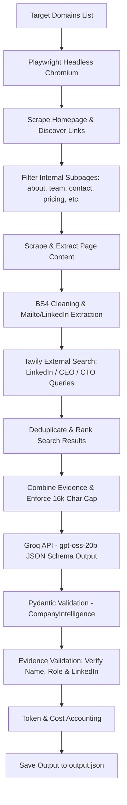

# Autonomous Lead Enrichment Agent

**Practical Assessment Submission | SoftwareBrio AI Engineer Intern**

An autonomous, fault-tolerant Python agent designed to extract structured company intelligence, leadership details, and B2B sales leads from target company websites. Built with **Playwright**, **BeautifulSoup4**, **Tavily Search API**, **Groq API** (`openai/gpt-oss-20b`), and **Pydantic v2**.

---

## Table of Contents

- [Overview](#overview)
- [Assignment Objective](#assignment-objective)
- [Architecture & Workflow](#architecture--workflow)
- [Technology Stack](#technology-stack)
- [Project Structure](#project-structure)
- [Module Responsibilities](#module-responsibilities)
- [Core Engineering Features](#core-engineering-features)
  - [Playwright Dynamic Browsing](#playwright-dynamic-browsing)
  - [Relevant Internal Page Discovery](#relevant-internal-page-discovery)
  - [BeautifulSoup HTML Cleaning](#beautifulsoup-html-cleaning)
  - [Token Optimization & Context Limits](#token-optimization--context-limits)
  - [Tavily External Search Integration](#tavily-external-search-integration)
  - [Groq LLM Extraction & JSON Schema Output](#groq-llm-extraction--json-schema-output)
  - [Pydantic Data Validation](#pydantic-data-validation)
  - [Leadership Evidence Validation](#leadership-evidence-validation)
  - [Token Usage & Cost Tracking](#token-usage--cost-tracking)
  - [Fault-Tolerant Pipeline](#fault-tolerant-pipeline)
- [Target Companies](#target-companies)
- [Example Output Structure](#example-output-structure)
- [Setup & Installation](#setup--installation)
- [Environment Variables](#environment-variables)
- [Running the Project](#running-the-project)
- [Independent Testing](#independent-testing)
- [Security & Credential Protection](#security--credential-protection)
- [Future Improvements](#future-improvements)
- [Author](#author)

---

## Overview

The **Autonomous Lead Enrichment Agent** automates B2B sales lead discovery and company research. Given target company domains, the agent:
1. Launches headless Playwright Chromium to handle dynamic JavaScript-rendered pages.
2. Discovers relevant internal subpages (`about`, `team`, `leadership`, `contact`, `pricing`, `company`).
3. Cleans HTML content while preserving contact details and mailto email links.
4. Executes targeted supplementary web searches via **Tavily API** for company and leadership LinkedIn context.
5. Merges website context and external search evidence up to a strict 16,000 character limit.
6. Queries **Groq LLM** (`openai/gpt-oss-20b`) enforcing JSON Schema structured output.
7. Validates response schemas using **Pydantic v2** and verifies leadership entries against raw evidence.
8. Tracks total token consumption and API costs, saving output to `output.json`.

---

## Assignment Objective

Developed for the **SoftwareBrio AI Engineer Intern Assessment**, this project demonstrates:
- End-to-end web scraping resilience and dynamic page navigation.
- Efficient token optimization and context window management.
- Grounded structured LLM extraction without hallucinations.
- Strict Pydantic type validation and multi-pass evidence verification.
- Transparent token usage and operational cost tracking.

---

## Architecture & Workflow



---

## Technology Stack

| Component | Technology | Role / Purpose |
| :--- | :--- | :--- |
| **Language** | Python 3.10+ | Core implementation language |
| **Web Automation** | Playwright (Chromium) | Dynamic DOM rendering & link navigation |
| **HTML Sanitization** | BeautifulSoup4 | Removal of scripts/styles while preserving text & contact info |
| **External Search** | Tavily API (`tavily-python`) | Supplementary web search for company & leadership LinkedIn info |
| **LLM Provider** | Groq API (`groq`) | High-speed LLM inference |
| **LLM Model** | `openai/gpt-oss-20b` | Structured company intelligence extraction |
| **Data Validation** | Pydantic v2 (`pydantic`) | Data schemas, type validation, and JSON schema generation |
| **Environment Management** | `python-dotenv` | Secure API key management |

---

## Project Structure

```
softwarebrio-ai-agent/
├── main.py              # Pipeline orchestration, context building, validation & output writer
├── scraper.py           # Playwright headless browser, link discovery, BS4 text cleaning & mailto links
├── search_agent.py      # Tavily search integration, relevance scoring, and deduplication
├── llm_extractor.py     # Groq API client, structured JSON schema response, token & cost tracking
├── models.py            # Pydantic data schemas (CompanyIntelligence, LeadershipMember)
├── test_browser.py      # Test script for Playwright navigation & text preview
├── test_model.py        # Test script for Pydantic schema serialization
├── requirements.txt     # Direct Python dependencies
├── output.json          # Formatted JSON results with company intelligence & cost summary
├── .env.example        # Environment variable template
└── .gitignore           # Git ignore file (venv, .env, __pycache__, *.pyc)
```

---

## Module Responsibilities

- **`main.py`**: Coordinates domain processing pipeline (`run_agent`), aggregates website and search contexts (`build_company_context`, `build_external_search_context`), collects deterministic metadata, verifies leadership against raw evidence (`validate_leadership_against_evidence`), calculates total cost summary (`create_cost_summary`), and exports to `output.json`.
- **`scraper.py`**: Manages Playwright Chromium headless instances (`scrape_company`), navigates internal links (`discover_pages`), cleans HTML by removing script/style/svg/noscript elements (`clean_text`), extracts mailto email addresses, and extracts visible LinkedIn profile context (`extract_page_links`, `extract_linkedin_context`).
- **`search_agent.py`**: Executes targeted Tavily queries for company, CEO, and CTO LinkedIn references (`search_company_externally`), assigns priority relevance scores (`calculate_result_priority`), and deduplicates results (`clean_search_results`).
- **`llm_extractor.py`**: Formulates structured extraction prompts for Groq's `openai/gpt-oss-20b` model enforcing JSON Schema format (`CompanyIntelligence.model_json_schema()`), parses output, validates Pydantic model (`model_validate`), and calculates estimated API costs per domain.
- **`models.py`**: Defines Pydantic v2 models `LeadershipMember` (with `linkedin_url` string defaulting to `""` if unavailable) and `CompanyIntelligence` (with numeric range check `confidence_score` between `0.0` and `1.0`).
- **`test_browser.py`**: Independent browser verification script for page navigation and text extraction preview.
- **`test_model.py`**: Independent schema validation script verifying Pydantic model initialization and serialization.

---

## Core Engineering Features

### Playwright Dynamic Browsing
Handles single-page applications (SPAs) and JavaScript-heavy websites using headless Chromium. Waits for `domcontentloaded` with network idle fallback to accommodate persistent web sockets.

### Relevant Internal Page Discovery
Analyzes homepages to discover internal subpages matching target keywords (`about`, `company`, `team`, `leadership`, `contact`, `pricing`). Ensures only same-domain HTTP/HTTPS links without fragment identifiers are crawled.

### BeautifulSoup HTML Cleaning
Strips non-content tags (`<script>`, `<style>`, `<svg>`, `<noscript>`) while explicitly preserving header, body, and footer structures where contact information and public emails reside. Converts HTML into cleaned plain text.

### Token Optimization & Context Limits
- **Per-Page Cap**: Truncates individual page text at **4,000 characters**.
- **Cumulative Context Cap**: Limits aggregate context (website content + external search evidence) sent to the LLM to **16,000 characters**.

### Tavily External Search Integration
Performs external searches via Tavily for company LinkedIn presence, CEO LinkedIn, and CTO LinkedIn. Search results are deduplicated by URL, scored by keyword relevance, truncated to 700 characters per item, and appended to the LLM context as supplementary evidence.

### Groq LLM Extraction & JSON Schema Output
Utilizes Groq API with `openai/gpt-oss-20b` configured with strict `json_schema` response formatting derived directly from Pydantic schemas. System prompts strictly mandate grounding in provided evidence only.

### Pydantic Data Validation
Enforces strict schema validation at runtime:
- `name`: Full string name.
- `role`: Title or function.
- `linkedin_url`: Valid URL string, or empty string `""` if unavailable (not `None`).
- `confidence_score`: Float constrained between `0.0` and `1.0` (`ge=0.0, le=1.0`).

### Leadership Evidence Validation
To eliminate LLM hallucinations, `validate_leadership_against_evidence()` runs post-extraction checks:
1. Requires full names (minimum 2 words).
2. Verifies that candidate name and role string exist within raw source evidence.
3. Rejects company LinkedIn pages (`/company/`) listed as personal LinkedIn profiles.
4. Strips unsupported or hallucinated LinkedIn URLs.

### Token Usage & Cost Tracking
Calculates estimated USD API costs based on Groq pricing rates for `openai/gpt-oss-20b` ($0.075 per 1M input tokens, $0.30 per 1M output tokens). Aggregates per-company metrics into a global `cost_summary` in `output.json`.

### Fault-Tolerant Pipeline
Individual page timeouts, network errors, or search failures are caught gracefully per page and domain, ensuring the pipeline finishes processing remaining targets without crashing.

---

## Target Companies

Default target domains configured in `main.py`:
1. `https://postman.com`
2. `https://supabase.com`
3. `https://vapi.ai`

---

## Example Output Structure

The output generated by the agent is saved to `output.json` in the following validated format:

```json
{
  "results": [
    {
      "company_overview": "Postman is a leading API platform that helps developers design, build, test, and document APIs with ease. It provides a suite of tools and AI‑enabled features for API lifecycle management across individuals, teams, and enterprises.",
      "target_audience": "Developers, API teams, and enterprises building, testing, and managing APIs.",
      "contact_points": [
        "accommodations@postman.com",
        "info-jp@postman.com",
        "info@postman.com"
      ],
      "leadership": [
        {
          "name": "Abhinav Asthana",
          "role": "CEO/Co-Founder",
          "linkedin_url": "https://www.linkedin.com/in/abhinavasthana"
        },
        {
          "name": "Ankit Sobti",
          "role": "CTO/Co-Founder",
          "linkedin_url": "https://www.linkedin.com/in/ankit-sobti"
        },
        {
          "name": "Abhijit Kane",
          "role": "Product Architect/Co-Founder",
          "linkedin_url": "https://in.linkedin.com/in/abhijitkane"
        }
      ],
      "confidence_score": 0.8,
      "domain": "https://postman.com",
      "usage": {
        "model": "openai/gpt-oss-20b",
        "input_tokens": 4132,
        "output_tokens": 839,
        "total_tokens": 4971,
        "estimated_cost_usd": 0.0005616
      }
    }
  ],
  "cost_summary": {
    "successful_companies": 3,
    "total_input_tokens": 13647,
    "total_output_tokens": 2860,
    "total_tokens": 16507,
    "estimated_total_cost_usd": 0.00188152
  }
}
```

---

## Setup & Installation

### Prerequisites
- **Python 3.10+**
- **Git**

### 1. Clone the Repository
```powershell
git clone <repository-url>
cd softwarebrio-ai-agent
```

### 2. Set Up Virtual Environment
```powershell
python -m venv venv
.\venv\Scripts\activate
```

### 3. Install Dependencies
```powershell
pip install -r requirements.txt
```

### 4. Install Playwright Chromium Browser
```powershell
playwright install chromium
```

---

## Environment Variables

Create a `.env` file in the project root directory using `.env.example` as a template:

```env
GROQ_API_KEY=your_groq_api_key_here
TAVILY_API_KEY=your_tavily_api_key_here
```

---

## Running the Project

Run the main pipeline to scrape target domains, perform external searches, invoke LLM extraction, and generate `output.json`:

```powershell
python main.py
```

---

## Independent Testing

Run lightweight test scripts to verify individual components:

- **Browser & Scraping Verification**:
  ```powershell
  python test_browser.py
  ```
- **Pydantic Schema Serialization Verification**:
  ```powershell
  python test_model.py
  ```

---

## Security & Credential Protection

- API credentials (`GROQ_API_KEY` and `TAVILY_API_KEY`) are stored strictly in `.env`.
- `.gitignore` is configured to prevent committing `.env`, `venv/`, `__pycache__/`, or `*.pyc` files.
- Real API keys are never printed, exposed in logs, or checked into version control.

---

## Future Improvements

- **Asynchronous Scraping**: Refactor sync Playwright calls to `asyncio` + `async_playwright` for parallel domain processing.
- **Export Formats**: Add CSV and Excel export options alongside JSON.
- **CRM Integration**: Direct export hooks for HubSpot and Salesforce lead generation.
- **Deep LinkedIn API Integration**: Targeted LinkedIn API lookups for executive verification.

---

## Author

**Aparna C**  
Software Engineering | AI/ML | MCA Graduate  
