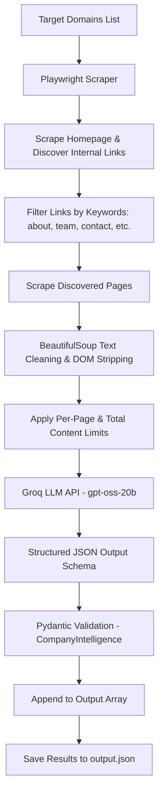

# Autonomous Lead Enrichment Agent

**Practical Assessment Submission | SoftwareBrio AI Engineer Intern**

An autonomous Python agent designed to extract structured company intelligence and B2B sales leads from target company websites. Built with **Playwright**, **BeautifulSoup4**, **Groq API** (`openai/gpt-oss-20b`), and **Pydantic**.

---

## Table of Contents

- [Overview](#overview)
- [Key Features](#key-features)
- [Architecture & Workflow](#architecture--workflow)
- [Technology Stack](#technology-stack)
- [Project Structure](#project-structure)
- [Python Modules Explanation](#python-modules-explanation)
- [Token Optimization Strategies](#token-optimization-strategies)
- [Structured LLM Output & Validation](#structured-llm-output--validation)
- [Error Handling & Resilience](#error-handling--resilience)
- [Target Companies](#target-companies)
- [Example Output Structure](#example-output-structure)
- [Setup & Installation (Windows)](#setup--installation-windows)
- [Running the Project](#running-the-project)
- [Security Note](#security-note)
- [Future Improvements](#future-improvements)
- [Author](#author)

---

## Overview

The **Autonomous Lead Enrichment Agent** automatically scrapes target company domains, handles JavaScript-rendered web pages, navigates to key internal pages (About, Team, Leadership, Contact, Pricing), cleans HTML content, and leverages Groq's fast LLM inference to extract high-value company insights. The agent outputs structured, schema-validated JSON containing company descriptions, Ideal Customer Profiles (ICP), generic email contacts, leadership details, and confidence ratings.

---

## Key Features

- **Automated Page Discovery**: Analyzes homepages and automatically discovers high-priority internal pages based on relevant URL keywords (`about`, `team`, `leadership`, `contact`, `pricing`, `company`).
- **Dynamic Content Scraping**: Leverages **Playwright** (Headless Chromium) to render JavaScript-heavy web applications.
- **HTML Content Cleaning**: Uses **BeautifulSoup4** to remove non-informational elements including `<script>`, `<style>`, `<svg>`, `<noscript>`, `<nav>`, `<header>`, and `<footer>`.
- **Token Optimization**: Enforces both per-page character limits (4,000 chars) and cumulative payload limits (16,000 chars) prior to LLM submission.
- **Structured JSON Extractions**: Uses Groq API with `openai/gpt-oss-20b` configured with `json_schema` response formatting.
- **Pydantic Validation**: Validates LLM outputs against predefined Python schemas (`CompanyIntelligence`, `LeadershipMember`) with range checks for confidence scores.
- **Fault-Tolerant Pipeline**: Uses granular error handling so individual page or domain failures are captured without unnecessarily stopping processing of other targets.
- **JSON File Output**: Consolidates enrichment records across all processed target domains into a clean `output.json` file.

---

## Architecture & Workflow



### Execution Flow Step-by-Step

1. **Domain Input**: Receives target URLs (`main.py`).
2. **Browsing & Discovery**: Playwright launches headless Chromium to load the homepage, waits for `domcontentloaded`, and inspects all `<a>` tags matching relevant internal keywords (`scraper.py`).
3. **Scraping & Cleaning**: Each page is fetched, stripped of scripts, styles, navigation, headers, and footers, and truncated to 4,000 characters.
4. **Context Aggregation**: Scraped page contents are aggregated into a single prompt payload capped at 16,000 characters total.
5. **LLM Extraction**: Content is submitted to Groq (`openai/gpt-oss-20b`) enforcing structured JSON response schemas (`llm_extractor.py`).
6. **Schema Validation**: Output is validated using Pydantic models (`models.py`).
7. **Storage**: Final structured data is saved to `output.json`.

---

## Technology Stack

| Component | Tool / Library | Description |
| :--- | :--- | :--- |
| **Language** | Python 3.10+ | Core programming environment |
| **Web Automation** | Playwright (Chromium) | Headless browser execution & dynamic DOM handling |
| **HTML Parser** | BeautifulSoup4 | HTML element removal and clean text extraction |
| **LLM Provider** | Groq API | High-speed LLM inference endpoint |
| **LLM Model** | `openai/gpt-oss-20b` | Open-source model for structured company intelligence extraction |
| **Data Validation** | Pydantic v2 | Data modeling, validation, and JSON schema generation |
| **Config Management** | `python-dotenv` | Environment variable management for API keys |

---

## Project Structure

```
softwarebrio-ai-agent/
│
├── main.py              # Agent entry point & orchestration pipeline
├── scraper.py           # Playwright scraper, link discovery & BS4 HTML cleaner
├── llm_extractor.py     # Groq API client & Pydantic structured response handler
├── models.py            # Pydantic data schemas (CompanyIntelligence, LeadershipMember)
├── test_browser.py      # Independent test script for Playwright web scraping
├── test_model.py        # Independent test script for Pydantic schema validation
├── requirements.txt     # Python package dependencies
├── output.json          # Formatted JSON output containing lead enrichment results
├── .env.example        # Environment variable template
└── .gitignore           # Git ignore file (excludes venv, .env, __pycache__)
```

---

## Python Modules Explanation

### `main.py`
The orchestration script that manages the lead enrichment workflow:
- Iterates over the `TARGET_DOMAINS` list.
- Calls `scrape_company()` to retrieve clean content from target homepages and internal subpages.
- Aggregates page contents up to a `MAX_TOTAL_CHARS` limit (16,000 characters).
- Sends aggregated text to `extract_company_intelligence()`.
- Captures individual domain failures safely into the results array.
- Writes the combined results to `output.json`.

### `scraper.py`
Handles web scraping and webpage content sanitization:
- **`scrape_company(domain)`**: Launches a headless Playwright Chromium browser, scrapes the homepage, calls `discover_pages()`, and scrapes all relevant internal subpages.
- **`discover_pages(page, homepage_url)`**: Inspects anchor tags on the homepage, checks if links match internal domain rules, and filters URLs based on key terms (`about`, `company`, `team`, `leadership`, `contact`, `pricing`).
- **`scrape_page(page, url)`**: Navigates to a URL with a 30-second timeout, extracts HTML, and applies cleaning and per-page content limits.
- **`clean_text(html)`**: Uses `BeautifulSoup` to decompose non-content tags (`script`, `style`, `svg`, `noscript`, `nav`, `footer`, `header`) and returns stripped plain text.

### `llm_extractor.py`
Manages interaction with the Groq LLM API:
- Loads `GROQ_API_KEY` from environment variables using `python-dotenv`.
- Formulates extraction system and user prompts with explicit strict grounding rules.
- Invokes `client.chat.completions.create()` using model `openai/gpt-oss-20b` and `json_schema` response format derived from `CompanyIntelligence.model_json_schema()`.
- Parses returned JSON text and validates it against `CompanyIntelligence` using `model_validate()`.

### `models.py`
Defines the Pydantic data models for structured outputs:
- **`LeadershipMember`**: Models team members with `name`, `role`, and optional `linkedin_url` (default `None`).
- **`CompanyIntelligence`**: Models the overall enrichment schema:
  - `company_overview`: Concise 2-sentence description.
  - `target_audience`: Ideal Customer Profile (ICP).
  - `contact_points`: List of generic public email addresses.
  - `leadership`: List of `LeadershipMember` objects.
  - `confidence_score`: Float between `0.0` and `1.0` (enforced via `ge=0.0, le=1.0`).

### `test_browser.py`
A lightweight verification script to test Playwright browser launching, page navigation, and DOM text preview independently.

### `test_model.py`
A verification script to test Pydantic schema instantiation and JSON serialization (`model_dump_json()`) without making live API calls.

---

## Token Optimization Strategies

To reduce token consumption, decrease API costs, and fit within LLM context windows, the agent implements multi-stage content reduction:

1. **Targeted Page Discovery**: Rather than crawling entire domains, `scraper.py` filters links by specific high-value keywords (`about`, `company`, `team`, `leadership`, `contact`, `pricing`).
2. **DOM Decomposition (`clean_text`)**: Removes heavy HTML boilerplate, scripts, CSS stylesheets, inline SVGs, navigation menus, headers, and footers prior to text extraction.
3. **Per-Page Character Cap**: Truncates scraped page text at **4,000 characters** per page (`MAX_PAGE_CHARS = 4000`), appending `[Content truncated]` if threshold is exceeded.
4. **Cumulative Payload Cap**: Limits total aggregated text sent to the LLM per company to **16,000 characters** (`MAX_TOTAL_CHARS = 16000`) across all discovered pages combined.

---

## Structured LLM Output & Pydantic Validation

The system improves output consistency by combining Groq structured JSON responses with Pydantic validation.

1. **Schema Export**: Pydantic generates a JSON Schema from `CompanyIntelligence.model_json_schema()`.
2. **Groq Structured Outputs**: Passed to `client.chat.completions.create` via `response_format`:
   ```python
   response_format={
       "type": "json_schema",
       "json_schema": {
           "name": "company_intelligence",
           "strict": False,
           "schema": CompanyIntelligence.model_json_schema()
       }
   }
   ```
3. **Runtime Validation**: The raw JSON output string is parsed and validated via `CompanyIntelligence.model_validate(result)` to validate data types, field names, and range bounds.

---

## Error Handling & Resilience

The pipeline is designed to execute robustly without stopping on isolated errors:

- **Browser & Network Failures**: `scrape_page()` catches navigation timeouts or rendering exceptions per page and returns a fallback dict containing the error message.
- **Link Discovery Guard**: `discover_pages()` catches individual link parsing exceptions in a `try/except` block, preventing broken URLs from interrupting link discovery.
- **Pipeline Continuity**: `run_agent()` wraps company enrichment in a top-level `try/except` block. If scraping or LLM extraction fails for one company, the agent logs the error, records `{"domain": domain, "error": str(e)}`, and continues to the next company.
- **Environment Validation**: `llm_extractor.py` checks for the presence of `GROQ_API_KEY` upon initialization and raises a clear `ValueError` if the key is missing.

---

## Target Companies

The agent currently enriches intelligence for the following target companies:
1. `https://postman.com`
2. `https://supabase.com`
3. `https://vapi.ai`

---

## Example Output Structure

Below is an example of the enriched company data saved in `output.json`:

```json
[
  {
    "company_overview": "Postman is a leading API platform that streamlines the entire API lifecycle, from development to collaboration. It enables developers and enterprises to build, test, and distribute APIs faster and with higher quality.",
    "target_audience": "API developers, engineering teams, and enterprises seeking to design, test, and manage APIs efficiently.",
    "contact_points": [
      "info@postman.com",
      "info-jp@postman.com"
    ],
    "leadership": [
      {
        "name": "Abhinav Asthana",
        "role": "CEO and co-founder",
        "linkedin_url": null
      },
      {
        "name": "Ankit Sobti",
        "role": "Co-founder",
        "linkedin_url": null
      },
      {
        "name": "Abhijit Kane",
        "role": "Co-founder",
        "linkedin_url": null
      }
    ],
    "confidence_score": 0.85,
    "domain": "https://postman.com"
  }
]
```

---

## Setup & Installation (Windows)

Follow these steps to set up and run the project on Windows.

### Prerequisites
- **Python 3.10+** installed
- **Git** installed

### 1. Clone the Repository
```powershell
git clone <repository-url>
cd softwarebrio-ai-agent
```

### 2. Set Up Virtual Environment
```powershell
python -m venv venv
.\venv\Scripts\activate
```

### 3. Install Dependencies
```powershell
pip install -r requirements.txt
```

### 4. Install Playwright Chromium Browser
```powershell
playwright install chromium
```

### 5. Configure Environment Variables
Create a `.env` file in the project root directory:

```env
GROQ_API_KEY=your_groq_api_key_here
```

> **Note**: Replace `your_groq_api_key_here` with your actual Groq API key from [Groq Console](https://console.groq.com/).

---

## Running the Project

### Execute Main Lead Enrichment Agent
Run the primary pipeline to scrape all target domains and generate `output.json`:

```powershell
python main.py
```

### Run Test Scripts (Optional)
To test browser scraping independently:
```powershell
python test_browser.py
```

To test Pydantic data model validation independently:
```powershell
python test_model.py
```

---

## Security Note

> [!IMPORTANT]
> **API Key Protection**: Secrets such as `GROQ_API_KEY` are stored in `.env` and must **never** be committed to Git repositories. The `.gitignore` file is configured to exclude `.env` and the `venv/` directory.

---

## Future Improvements

Potential enhancements planned for future iterations:

- **Search Engine & External APIs**: Integrate Tavily or SerpAPI for search-based lead discovery when direct website navigation yields minimal details.
- **LinkedIn Enrichment**: Add targeted LinkedIn search APIs to populate missing executive profile URLs.
- **Advanced Agent Orchestration**: Integrate LangGraph or Browser-Use for autonomous multi-step decision-making and deep web browsing.
- **Data Export Formats**: Support CSV, Excel, and CRM integrations (HubSpot/Salesforce).
- **Cost & Token Tracking**: Implement real-time token tracking and estimated API cost reporting per run.
- **Asynchronous Scraping**: Convert sync Playwright to `asyncio` for parallel multi-domain scraping.

---

## Author

**Aparna C**

MCA Graduate | Software Engineering | AI/ML
